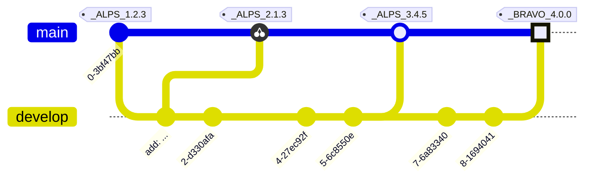

# RELEASE NOTES

All notable changes to this project will be documented in this file.

The format is based on [Keep a Changelog](https://keepachangelog.com/en/1.0.0/),
and this project adheres to a flavor of [Semantic Versioning](https://semver.org/spec/v2.0.0.html)
which includes [Scopes and Epochs](#epoch-scoped-semver).

---


#### Quick Navigation

**Scope** | Current Release | Commit Count
:--- | :---: | :---:
[**ArkUI**](#arkui) | [0.2.3](https://github.com/shayanhabibi/Partas.Solid.Bindings/compare/_%28ArkUI%29_0.2.2..._%28ArkUI%29_0.2.3) | 1 commits
[**Cmdk**](#cmdk) | [0.2.3](https://github.com/shayanhabibi/Partas.Solid.Bindings/compare/_%28Cmdk%29_0.2.2..._%28Cmdk%29_0.2.3) | 1 commits
[**Corvu**](#corvu) | [0.2.3](https://github.com/shayanhabibi/Partas.Solid.Bindings/compare/_%28Corvu%29_0.2.2..._%28Corvu%29_0.2.3) | 1 commits
[**Internationalised**](#internationalised) | [0.1.2](https://github.com/shayanhabibi/Partas.Solid.Bindings/compare/_%28Internationalised%29_0.1.1..._%28Internationalised%29_0.1.2) | 1 commits
[**Kobalte**](#kobalte) | [0.4.1](https://github.com/shayanhabibi/Partas.Solid.Bindings/compare/_%28Kobalte%29_0.4.0..._%28Kobalte%29_0.4.1) | 3 commits
[**Lucide**](#lucide) | [0.513.1](https://github.com/shayanhabibi/Partas.Solid.Bindings/compare/_%28Lucide%29_0.513.0..._%28Lucide%29_0.513.1) | 1 commits
[**ModularForms**](#modularforms) | [0.2.2](https://github.com/shayanhabibi/Partas.Solid.Bindings/compare/_%28ModularForms%29_0.2.1..._%28ModularForms%29_0.2.2) | 1 commits
[**Motion**](#motion) | [0.2.2](https://github.com/shayanhabibi/Partas.Solid.Bindings/compare/_%28Motion%29_0.2.1..._%28Motion%29_0.2.2) | 1 commits
[**NeoDrag**](#neodrag) | [0.2.1](https://github.com/shayanhabibi/Partas.Solid.Bindings/compare/_%28NeoDrag%29_0.2.0..._%28NeoDrag%29_0.2.1) | 1 commits
[**Sonner**](#sonner) | [0.2.2](https://github.com/shayanhabibi/Partas.Solid.Bindings/compare/_%28Sonner%29_0.2.1..._%28Sonner%29_0.2.2) | 1 commits
[**Storybook**](#storybook) | [0.2.1](https://github.com/shayanhabibi/Partas.Solid.Bindings/compare/_%28Storybook%29_0.2.0..._%28Storybook%29_0.2.1) | 1 commits
[**Table**](#table) | [0.2.1](https://github.com/shayanhabibi/Partas.Solid.Bindings/compare/_%28Table%29_0.2.0..._%28Table%29_0.2.1) | 1 commits
[**ApexCharts**](#apexcharts) | [0.2.2](https://github.com/shayanhabibi/Partas.Solid.Bindings/commit/9ec3269ac3c7564668c4ada409d59a4fd45b04e4) | None yet!
[**Build**](#build) | Unreleased | None yet!
[**Cva**](#cva) | [0.1.0](https://github.com/shayanhabibi/Partas.Solid.Bindings/commit/8fe28819955fec8c7e989f58a8fe88c5e67f1d8e) | None yet!
[**ZagJs**](#zagjs) | [0.1.2](https://github.com/shayanhabibi/Partas.Solid.Bindings/compare/_%28ZagJs%29_0.1.1..._%28ZagJs%29_0.1.2) | 1 commits


-----------------------

# ArkUI

### [UNRELEASED](https://github.com/shayanhabibi/Partas.Solid.Bindings/compare/_%28ArkUI%29_0.2.3...HEAD)

### [0.2.3](https://github.com/shayanhabibi/Partas.Solid.Bindings/compare/_%28ArkUI%29_0.2.2..._%28ArkUI%29_0.2.3) - (2025-08-22)

#### <!-- 2 --> Fixed

* Force initial tagging of all projects by [@cabboose](https://github.com/shayanhabibi/Partas.Solid.Bindings/cabboose) with [#b5e6c](https://github.com/shayanhabibi/Partas.Solid.Bindings/commit/b5e6cb6262c060ea6fe742835601c00f3abb188b)
  

<div align="right"><a href="#quick-navigation">(back to top)</a></div>

-----------------------

# Cmdk

### [UNRELEASED](https://github.com/shayanhabibi/Partas.Solid.Bindings/compare/_%28Cmdk%29_0.2.3...HEAD)

### [0.2.3](https://github.com/shayanhabibi/Partas.Solid.Bindings/compare/_%28Cmdk%29_0.2.2..._%28Cmdk%29_0.2.3) - (2025-08-22)

#### <!-- 2 --> Fixed

* Force initial tagging of all projects by [@cabboose](https://github.com/shayanhabibi/Partas.Solid.Bindings/cabboose) with [#b5e6c](https://github.com/shayanhabibi/Partas.Solid.Bindings/commit/b5e6cb6262c060ea6fe742835601c00f3abb188b)
  

<div align="right"><a href="#quick-navigation">(back to top)</a></div>

-----------------------

# Corvu

### [UNRELEASED](https://github.com/shayanhabibi/Partas.Solid.Bindings/compare/_%28Corvu%29_0.2.3...HEAD)

### [0.2.3](https://github.com/shayanhabibi/Partas.Solid.Bindings/compare/_%28Corvu%29_0.2.2..._%28Corvu%29_0.2.3) - (2025-08-22)

#### <!-- 2 --> Fixed

* Force initial tagging of all projects by [@cabboose](https://github.com/shayanhabibi/Partas.Solid.Bindings/cabboose) with [#b5e6c](https://github.com/shayanhabibi/Partas.Solid.Bindings/commit/b5e6cb6262c060ea6fe742835601c00f3abb188b)
  

<div align="right"><a href="#quick-navigation">(back to top)</a></div>

-----------------------

# Internationalised

### [UNRELEASED](https://github.com/shayanhabibi/Partas.Solid.Bindings/compare/_%28Internationalised%29_0.1.2...HEAD)

### [0.1.2](https://github.com/shayanhabibi/Partas.Solid.Bindings/compare/_%28Internationalised%29_0.1.1..._%28Internationalised%29_0.1.2) - (2025-08-22)

#### <!-- 2 --> Fixed

* Force initial tagging of all projects by [@cabboose](https://github.com/shayanhabibi/Partas.Solid.Bindings/cabboose) with [#b5e6c](https://github.com/shayanhabibi/Partas.Solid.Bindings/commit/b5e6cb6262c060ea6fe742835601c00f3abb188b)
  

<div align="right"><a href="#quick-navigation">(back to top)</a></div>

-----------------------

# Kobalte

### [UNRELEASED](https://github.com/shayanhabibi/Partas.Solid.Bindings/compare/_%28Kobalte%29_0.4.1...HEAD)

### [0.4.1](https://github.com/shayanhabibi/Partas.Solid.Bindings/compare/_%28Kobalte%29_0.4.0..._%28Kobalte%29_0.4.1) - (2025-09-18)

#### <!-- 2 --> Fixed

* typo and missing context for colorfield by [@cabboose](https://github.com/shayanhabibi/Partas.Solid.Bindings/cabboose) with [#831a5](https://github.com/shayanhabibi/Partas.Solid.Bindings/commit/831a5dad8a94a9d1cb457807ffc9bf00d2a65bb1)
  

### [0.4.0](https://github.com/shayanhabibi/Partas.Solid.Bindings/compare/_%28Kobalte%29_0.3.6..._%28Kobalte%29_0.4.0) - (2025-09-02)

#### <!-- 6 --> Others

* add bindings to more of the contexts by [@cabboose](https://github.com/shayanhabibi/Partas.Solid.Bindings/cabboose) with [#b105c](https://github.com/shayanhabibi/Partas.Solid.Bindings/commit/b105c7c07de91630d81c5d8f9407d438fa8b6f0d)
  

### [0.3.6](https://github.com/shayanhabibi/Partas.Solid.Bindings/compare/_%28Kobalte%29_0.3.5..._%28Kobalte%29_0.3.6) - (2025-08-22)

#### <!-- 2 --> Fixed

* Force initial tagging of all projects by [@cabboose](https://github.com/shayanhabibi/Partas.Solid.Bindings/cabboose) with [#b5e6c](https://github.com/shayanhabibi/Partas.Solid.Bindings/commit/b5e6cb6262c060ea6fe742835601c00f3abb188b)
  

<div align="right"><a href="#quick-navigation">(back to top)</a></div>

-----------------------

# Lucide

### [UNRELEASED](https://github.com/shayanhabibi/Partas.Solid.Bindings/compare/_%28Lucide%29_0.513.1...HEAD)

### [0.513.1](https://github.com/shayanhabibi/Partas.Solid.Bindings/compare/_%28Lucide%29_0.513.0..._%28Lucide%29_0.513.1) - (2025-08-22)

#### <!-- 2 --> Fixed

* Force initial tagging of all projects by [@cabboose](https://github.com/shayanhabibi/Partas.Solid.Bindings/cabboose) with [#b5e6c](https://github.com/shayanhabibi/Partas.Solid.Bindings/commit/b5e6cb6262c060ea6fe742835601c00f3abb188b)
  

<div align="right"><a href="#quick-navigation">(back to top)</a></div>

-----------------------

# ModularForms

### [UNRELEASED](https://github.com/shayanhabibi/Partas.Solid.Bindings/compare/_%28ModularForms%29_0.2.2...HEAD)

### [0.2.2](https://github.com/shayanhabibi/Partas.Solid.Bindings/compare/_%28ModularForms%29_0.2.1..._%28ModularForms%29_0.2.2) - (2025-08-22)

#### <!-- 2 --> Fixed

* Force initial tagging of all projects by [@cabboose](https://github.com/shayanhabibi/Partas.Solid.Bindings/cabboose) with [#b5e6c](https://github.com/shayanhabibi/Partas.Solid.Bindings/commit/b5e6cb6262c060ea6fe742835601c00f3abb188b)
  

<div align="right"><a href="#quick-navigation">(back to top)</a></div>

-----------------------

# Motion

### [UNRELEASED](https://github.com/shayanhabibi/Partas.Solid.Bindings/compare/_%28Motion%29_0.2.2...HEAD)

### [0.2.2](https://github.com/shayanhabibi/Partas.Solid.Bindings/compare/_%28Motion%29_0.2.1..._%28Motion%29_0.2.2) - (2025-08-22)

#### <!-- 2 --> Fixed

* Force initial tagging of all projects by [@cabboose](https://github.com/shayanhabibi/Partas.Solid.Bindings/cabboose) with [#b5e6c](https://github.com/shayanhabibi/Partas.Solid.Bindings/commit/b5e6cb6262c060ea6fe742835601c00f3abb188b)
  

<div align="right"><a href="#quick-navigation">(back to top)</a></div>

-----------------------

# NeoDrag

### [UNRELEASED](https://github.com/shayanhabibi/Partas.Solid.Bindings/compare/_%28NeoDrag%29_0.2.1...HEAD)

### [0.2.1](https://github.com/shayanhabibi/Partas.Solid.Bindings/compare/_%28NeoDrag%29_0.2.0..._%28NeoDrag%29_0.2.1) - (2025-08-22)

#### <!-- 2 --> Fixed

* Force initial tagging of all projects by [@cabboose](https://github.com/shayanhabibi/Partas.Solid.Bindings/cabboose) with [#b5e6c](https://github.com/shayanhabibi/Partas.Solid.Bindings/commit/b5e6cb6262c060ea6fe742835601c00f3abb188b)
  

<div align="right"><a href="#quick-navigation">(back to top)</a></div>

-----------------------

# Sonner

### [UNRELEASED](https://github.com/shayanhabibi/Partas.Solid.Bindings/compare/_%28Sonner%29_0.2.2...HEAD)

### [0.2.2](https://github.com/shayanhabibi/Partas.Solid.Bindings/compare/_%28Sonner%29_0.2.1..._%28Sonner%29_0.2.2) - (2025-08-22)

#### <!-- 2 --> Fixed

* Force initial tagging of all projects by [@cabboose](https://github.com/shayanhabibi/Partas.Solid.Bindings/cabboose) with [#b5e6c](https://github.com/shayanhabibi/Partas.Solid.Bindings/commit/b5e6cb6262c060ea6fe742835601c00f3abb188b)
  

<div align="right"><a href="#quick-navigation">(back to top)</a></div>

-----------------------

# Storybook

### [UNRELEASED](https://github.com/shayanhabibi/Partas.Solid.Bindings/compare/_%28Storybook%29_0.2.1...HEAD)

### [0.2.1](https://github.com/shayanhabibi/Partas.Solid.Bindings/compare/_%28Storybook%29_0.2.0..._%28Storybook%29_0.2.1) - (2025-08-22)

#### <!-- 2 --> Fixed

* Force initial tagging of all projects by [@cabboose](https://github.com/shayanhabibi/Partas.Solid.Bindings/cabboose) with [#b5e6c](https://github.com/shayanhabibi/Partas.Solid.Bindings/commit/b5e6cb6262c060ea6fe742835601c00f3abb188b)
  

<div align="right"><a href="#quick-navigation">(back to top)</a></div>

-----------------------

# Table

### [UNRELEASED](https://github.com/shayanhabibi/Partas.Solid.Bindings/compare/_%28Table%29_0.2.1...HEAD)

### [0.2.1](https://github.com/shayanhabibi/Partas.Solid.Bindings/compare/_%28Table%29_0.2.0..._%28Table%29_0.2.1) - (2025-08-22)

#### <!-- 2 --> Fixed

* Force initial tagging of all projects by [@cabboose](https://github.com/shayanhabibi/Partas.Solid.Bindings/cabboose) with [#b5e6c](https://github.com/shayanhabibi/Partas.Solid.Bindings/commit/b5e6cb6262c060ea6fe742835601c00f3abb188b)
  

<div align="right"><a href="#quick-navigation">(back to top)</a></div>

-----------------------

# ApexCharts

No commits at this time.

# Build

No commits at this time.

# Cva

No commits at this time.

# ZagJs

### [UNRELEASED](https://github.com/shayanhabibi/Partas.Solid.Bindings/compare/_%28ZagJs%29_0.1.2...HEAD)

### [0.1.2](https://github.com/shayanhabibi/Partas.Solid.Bindings/compare/_%28ZagJs%29_0.1.1..._%28ZagJs%29_0.1.2) - (2025-08-22)

#### <!-- 2 --> Fixed

* Force initial tagging of all projects by [@cabboose](https://github.com/shayanhabibi/Partas.Solid.Bindings/cabboose) with [#b5e6c](https://github.com/shayanhabibi/Partas.Solid.Bindings/commit/b5e6cb6262c060ea6fe742835601c00f3abb188b)
  

<div align="right"><a href="#quick-navigation">(back to top)</a></div>

-----------------------


---

<details>
<summary>Read more about this SemVer flavor</summary>

### Epoch Scoped SemVer

This flavor adds an optional marketable value called an `EPOCH`.
There is also an optional disambiguating `SCOPE` identifier for delineating tags for packages in a mono repo.

<blockquote>The motivation for this is to prevent resistance to utilising SemVer major bumps
correctly, by allowing a separate marketable identifier which is easily compatible
with the current SemVer spec.</blockquote>


An Epoch/Scope (*Sepoch*) is an OPTIONAL prefix to a typical SemVer.

* A Sepoch MUST BE bounded by `_` underscores `_`.
* The identifiers MUST BE ALPHABETICAL (A-Za-z) identifiers.
* The Epoch SHOULD BE upper case
* The Epoch MUST come before the Scope, if both are present.
* The Scope MUST additionally be bounded by `(` parenthesis `)`.
* The Scope SHOULD BE capitalised/pascal cased.
* A Sepoch CAN BE separated from SemVer by a single white space where this is allowed (ie not allowed in git tags).
* Epoch DOES NOT influence precedence.
* Scope MUST uniquely identify a single components versioning.
* Different scopes CANNOT BE compared for precedence.
* A SemVer without a Scope CAN BE compared to a Scoped SemVer for compatibility. But caution is advised.

> There is no enforcement for ordering EPOCHs in this spec, as it
would be overly restrictive and yield little value since we can delineate and
earlier EPOCH from a later EPOCH by the SemVers.

#### Example



*While there are breaking changes between versions 1 to 3, we expect that it is less than
from 3 to 4. We expect the API surface would change more dramatically, or there is some other significant
milestone improvement, in the change from version 3 epoch ALPS to version 4 epoch BRAVO.*

```
_WILDLANDS(Core)_ 4.2.0
_WILDLANDS(Engine)_ 0.5.3
_DELTA(Core)_ 5.0.0
_DELTA(Engine)_ 0.5.3
```

*Cannot be compared to `Core` versions. Both Engine versions are equal, we can identify that
the ecosystems marketed change does not change the Engine packages API*

</details>

<!-- generated by Partas.GitNet -->
