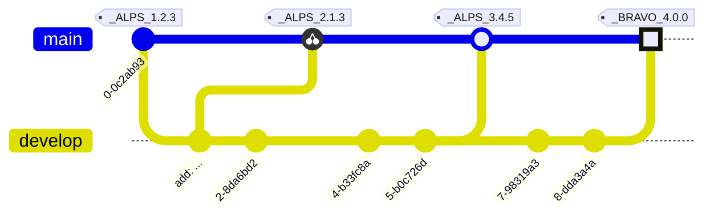

# RELEASE NOTES

All notable changes to this project will be documented in this file.

The format is based on [Keep a Changelog](https://keepachangelog.com/en/1.0.0/),
and this project adheres to a flavored version of [Semantic Versioning](https://semver.org/spec/v2.0.0.html).

<details>
<summary>See the spec for this SemVer flavor.</summary>
<h3>Epoch Scoped Semver</h3>
This flavor adds an optional marketable value called an `EPOCH`.
There is also an optional disambiguating `SCOPE` identifier for delineating tags for packages in a mono repo.

<blockquote>The motivation for this is to prevent resistance to utilising SemVer major bumps
correctly, by allowing a separate marketable identifier which is easily compatible
with the current SemVer spec.</blockquote>
An Epoch/Scope (**Sepoch**) is an OPTIONAL prefix to a typical SemVer.

* A Sepoch MUST BE bounded by `_` underscores `_`.

* The identifiers MUST BE ALPHABETICAL (A-Za-z) identifiers.

* The Epoch SHOULD BE upper case

* The Epoch MUST come before the Scope, if both are present.

* The Scope MUST additionally be bounded by `(` parenthesis `)`.

* The Scope SHOULD BE capitalised/pascal cased.

* A Sepoch CAN BE separated from SemVer by a single white space where this is allowed (ie not allowed in git tags).

* Epoch DOES NOT influence precedence.

* Scope MUST uniquely identify a single components versioning.

* Different scopes CANNOT BE compared for precedence.

* A SemVer without a Scope CAN BE compared to a Scoped SemVer for compatibility. But caution is advised.

> There is no enforcement for ordering EPOCHs in this spec, as it
would be overly restrictive and yield little value since we can delineate and
earlier EPOCH from a later EPOCH by the SemVers.
> 

**Examples:**



**While there are breaking changes between versions 1 to 3, we expect that it is less than
from 3 to 4. We expect the API surface would change more dramatically, or there is some other significant
milestone improvement, in the change from version 3 epoch ALPS to version 4 epoch BRAVO.**

```
_WILDLANDS(Core)_ 4.2.0
_WILDLANDS(Engine)_ 0.5.3
_DELTA(Core)_ 5.0.0
_DELTA(Engine)_ 0.5.3

```

**Cannot be compared to `Core` versions. Both Engine versions are equal, we can identify that
the ecosystems marketed change does not change the Engine packages API**

</details>
<details>
<summary>Quick navigation</summary>
<h3>Scopes:</h3>
<ul>
<li><a href="#apexcharts">ApexCharts</a></li>
<li><a href="#arkui">ArkUI</a></li>
<li><a href="#build">Build</a></li>
<li><a href="#cmdk">Cmdk</a></li>
<li><a href="#corvu">Corvu</a></li>
<li><a href="#cva">Cva</a></li>
<li><a href="#internationalised">Internationalised</a></li>
<li><a href="#kobalte">Kobalte</a></li>
<li><a href="#lucide">Lucide</a></li>
<li><a href="#modularforms">ModularForms</a></li>
<li><a href="#motion">Motion</a></li>
<li><a href="#neodrag">NeoDrag</a></li>
<li><a href="#sonner">Sonner</a></li>
<li><a href="#storybook">Storybook</a></li>
<li><a href="#table">Table</a></li>
<li><a href="#zagjs">ZagJs</a></li>
</ul>
</details>
-----------------------

# ApexCharts

## [UNRELEASED](https://github.com/shayanhabibi/Partas.Solid.Bindings/compare/_%28ApexCharts%29_0.2.2...HEAD)

-----------------------

# ArkUI

## [UNRELEASED](https://github.com/shayanhabibi/Partas.Solid.Bindings/compare/_%28ArkUI%29_0.2.2...HEAD)

* Force initial tagging of all projects - cabboose@[b5e6c](https://github.com/shayanhabibi/Partas.Solid.Bindings/commit/b5e6cb6262c060ea6fe742835601c00f3abb188b)
  

-----------------------

# Build

## UNRELEASED

-----------------------

# Cmdk

## [UNRELEASED](https://github.com/shayanhabibi/Partas.Solid.Bindings/compare/_%28Cmdk%29_0.2.2...HEAD)

* Force initial tagging of all projects - cabboose@[b5e6c](https://github.com/shayanhabibi/Partas.Solid.Bindings/commit/b5e6cb6262c060ea6fe742835601c00f3abb188b)
  

-----------------------

# Corvu

## [UNRELEASED](https://github.com/shayanhabibi/Partas.Solid.Bindings/compare/_%28Corvu%29_0.2.2...HEAD)

* Force initial tagging of all projects - cabboose@[b5e6c](https://github.com/shayanhabibi/Partas.Solid.Bindings/commit/b5e6cb6262c060ea6fe742835601c00f3abb188b)
  

-----------------------

# Cva

## [UNRELEASED](https://github.com/shayanhabibi/Partas.Solid.Bindings/compare/_%28Cva%29_0.1.0...HEAD)

-----------------------

# Internationalised

## [UNRELEASED](https://github.com/shayanhabibi/Partas.Solid.Bindings/compare/_%28Internationalised%29_0.1.1...HEAD)

* Force initial tagging of all projects - cabboose@[b5e6c](https://github.com/shayanhabibi/Partas.Solid.Bindings/commit/b5e6cb6262c060ea6fe742835601c00f3abb188b)
  

-----------------------

# Kobalte

## [UNRELEASED](https://github.com/shayanhabibi/Partas.Solid.Bindings/compare/_%28Kobalte%29_0.3.5...HEAD)

* Force initial tagging of all projects - cabboose@[b5e6c](https://github.com/shayanhabibi/Partas.Solid.Bindings/commit/b5e6cb6262c060ea6fe742835601c00f3abb188b)
  

-----------------------

# Lucide

## [UNRELEASED](https://github.com/shayanhabibi/Partas.Solid.Bindings/compare/_%28Lucide%29_0.513.0...HEAD)

* Force initial tagging of all projects - cabboose@[b5e6c](https://github.com/shayanhabibi/Partas.Solid.Bindings/commit/b5e6cb6262c060ea6fe742835601c00f3abb188b)
  

-----------------------

# ModularForms

## [UNRELEASED](https://github.com/shayanhabibi/Partas.Solid.Bindings/compare/_%28ModularForms%29_0.2.1...HEAD)

* Force initial tagging of all projects - cabboose@[b5e6c](https://github.com/shayanhabibi/Partas.Solid.Bindings/commit/b5e6cb6262c060ea6fe742835601c00f3abb188b)
  

-----------------------

# Motion

## [UNRELEASED](https://github.com/shayanhabibi/Partas.Solid.Bindings/compare/_%28Motion%29_0.2.1...HEAD)

* Force initial tagging of all projects - cabboose@[b5e6c](https://github.com/shayanhabibi/Partas.Solid.Bindings/commit/b5e6cb6262c060ea6fe742835601c00f3abb188b)
  

-----------------------

# NeoDrag

## [UNRELEASED](https://github.com/shayanhabibi/Partas.Solid.Bindings/compare/_%28NeoDrag%29_0.2.0...HEAD)

* Force initial tagging of all projects - cabboose@[b5e6c](https://github.com/shayanhabibi/Partas.Solid.Bindings/commit/b5e6cb6262c060ea6fe742835601c00f3abb188b)
  

-----------------------

# Sonner

## [UNRELEASED](https://github.com/shayanhabibi/Partas.Solid.Bindings/compare/_%28Sonner%29_0.2.1...HEAD)

* Force initial tagging of all projects - cabboose@[b5e6c](https://github.com/shayanhabibi/Partas.Solid.Bindings/commit/b5e6cb6262c060ea6fe742835601c00f3abb188b)
  

-----------------------

# Storybook

## [UNRELEASED](https://github.com/shayanhabibi/Partas.Solid.Bindings/compare/_%28Storybook%29_0.2.0...HEAD)

* Force initial tagging of all projects - cabboose@[b5e6c](https://github.com/shayanhabibi/Partas.Solid.Bindings/commit/b5e6cb6262c060ea6fe742835601c00f3abb188b)
  

-----------------------

# Table

## [UNRELEASED](https://github.com/shayanhabibi/Partas.Solid.Bindings/compare/_%28Table%29_0.2.0...HEAD)

* Force initial tagging of all projects - cabboose@[b5e6c](https://github.com/shayanhabibi/Partas.Solid.Bindings/commit/b5e6cb6262c060ea6fe742835601c00f3abb188b)
  

-----------------------

# ZagJs

## [UNRELEASED](https://github.com/shayanhabibi/Partas.Solid.Bindings/compare/_%28ZagJs%29_0.1.1...HEAD)

* Force initial tagging of all projects - cabboose@[b5e6c](https://github.com/shayanhabibi/Partas.Solid.Bindings/commit/b5e6cb6262c060ea6fe742835601c00f3abb188b)
  

-----------------------

<!-- generated by Partas.GitNet -->